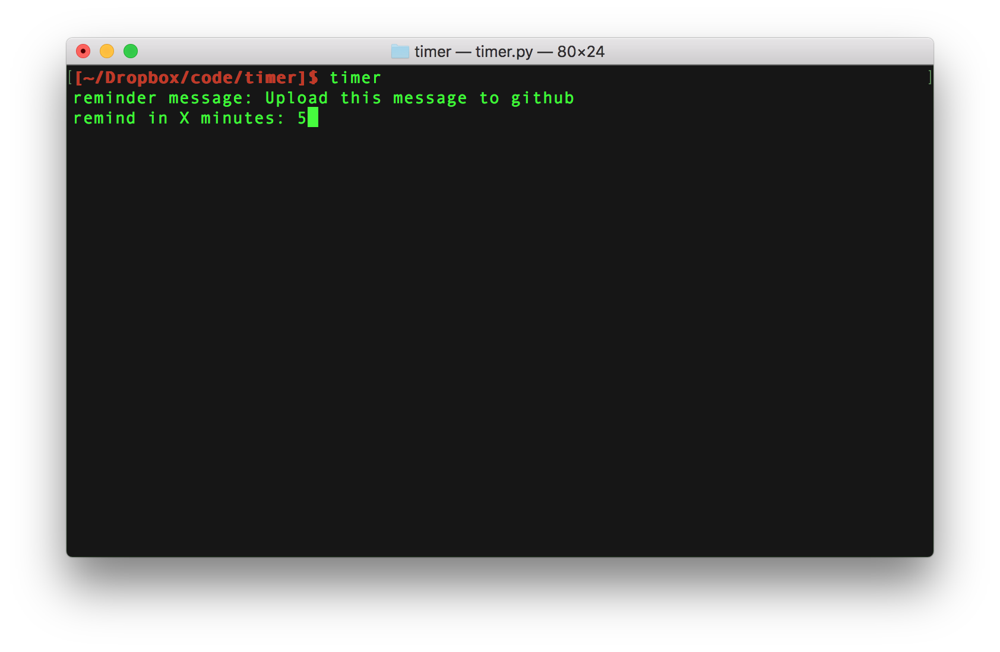
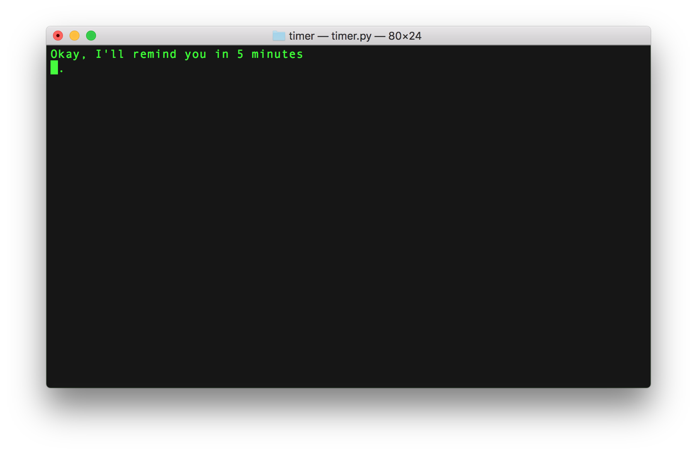

simple command line timer

starting the timer with a value will set it for that many minutes

    timer 5

starting the timer with no cli value will prompt for it:

Add it to your .profile

    alias timer='timer.py'

change out the wav file for anything else

